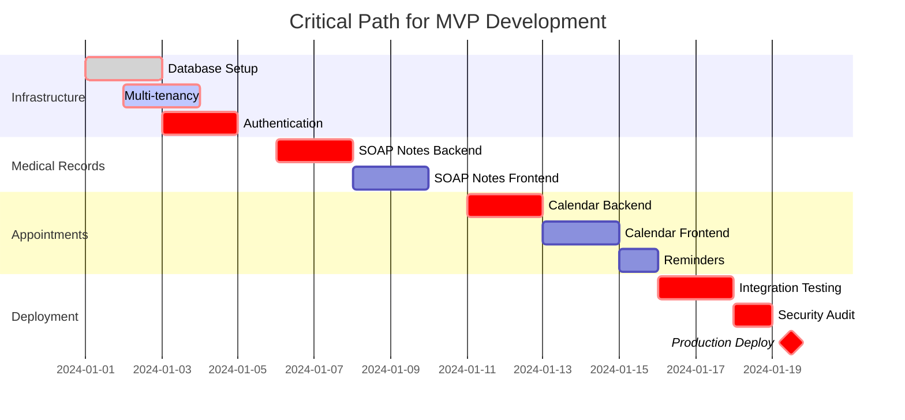

# Product Design Review (PDR) Document
## VetClinic SaaS Platform MVP

---

## 1. EXECUTIVE SUMMARY

### 1.1 Project Overview
Development of a multi-tenant SaaS platform for veterinary clinics focusing on appointment scheduling, electronic health records (EHR), and practice management. The MVP targets solo practitioners and small clinics (2-5 veterinarians) in Massachusetts, USA.

### 1.2 Technical Overview
- **Architecture**: Multi-tenant SaaS with tenant isolation at application layer
- **Technology Stack**: Node.js/Express.js backend, React frontend, MySQL database, Cloudflare infrastructure
- **Deployment Model**: Cloud-native, containerized microservices architecture
- **Target Launch**: 1-month development cycle (Critical Risk Factor)
- **Initial Scale**: 10 clinics, 50 appointments/day total, 1000 potential concurrent users

### 1.3 Key Success Metrics
- System uptime: 99.9% availability
- Response time: <200ms for API calls, <2s page load
- Data integrity: Zero data loss, ACID compliance
- Security: HIPAA-compliant infrastructure

---

## 2. SYSTEM ARCHITECTURE

### 2.1 High-Level Architecture

```
┌─────────────────────────────────────────────────────────────┐
│                     Cloudflare Edge Network                  │
│                   (CDN, DDoS Protection, WAF)                │
└──────────────────────┬──────────────────────────────────────┘
                       │
┌──────────────────────▼──────────────────────────────────────┐
│                    Application Layer                         │
├──────────────────────────────────────────────────────────────┤
│  ┌─────────────┐  ┌─────────────┐  ┌──────────────┐       │
│  │  React SPA  │  │   Next.js   │  │  Static      │       │
│  │  (Client)   │  │   (SSR)     │  │  Assets      │       │
│  └──────┬──────┘  └──────┬──────┘  └──────┬───────┘       │
│         │                 │                 │                │
│  ┌──────▼─────────────────▼─────────────────▼───────┐       │
│  │          NGINX Load Balancer / API Gateway       │       │
│  └──────────────────────┬───────────────────────────┘       │
└─────────────────────────┼───────────────────────────────────┘
                          │
┌─────────────────────────▼───────────────────────────────────┐
│                    Microservices Layer                       │
├──────────────────────────────────────────────────────────────┤
│  ┌──────────────┐  ┌──────────────┐  ┌──────────────┐     │
│  │ Auth Service │  │ Appointment  │  │  EHR Service │     │
│  │  (Node.js)   │  │   Service    │  │   (Node.js)  │     │
│  └──────┬───────┘  └──────┬───────┘  └──────┬───────┘     │
│         │                  │                  │              │
│  ┌──────▼──────────────────▼──────────────────▼──────┐     │
│  │            Message Queue (Redis/Bull)              │     │
│  └─────────────────────────┬──────────────────────────┘     │
└────────────────────────────┼────────────────────────────────┘
                             │
┌────────────────────────────▼────────────────────────────────┐
│                     Data Layer                               │
├──────────────────────────────────────────────────────────────┤
│  ┌──────────────┐  ┌──────────────┐  ┌──────────────┐     │
│  │  MySQL       │  │  Redis       │  │  Object      │     │
│  │  (Primary)   │  │  (Cache)     │  │  Storage     │     │
│  └──────────────┘  └──────────────┘  │  (R2/S3)     │     │
│                                       └──────────────┘     │
└──────────────────────────────────────────────────────────────┘
```

### 2.2 Multi-Tenancy Strategy

**Shared Database, Shared Schema Pattern**
- Tenant isolation via `clinic_id` discriminator column
- Row-level security (RLS) policies
- Connection pooling with tenant context injection
- Query interceptors for automatic tenant filtering

```javascript
// Tenant Isolation Middleware
class TenantIsolation {
  static async injectTenantContext(req, res, next) {
    const tenantId = req.user?.clinic_id || req.headers['x-tenant-id'];
    req.tenantContext = {
      clinic_id: tenantId,
      organization_id: req.user?.organization_id
    };
    
    // Set MySQL session variable for RLS
    await db.query('SET @tenant_id = ?', [tenantId]);
    next();
  }
}
```

### 2.3 Database Architecture

```sql
-- Core Tenant Structure
CREATE TABLE organizations (
  id VARCHAR(36) PRIMARY KEY,
  name VARCHAR(255) NOT NULL,
  subscription_tier ENUM('starter', 'professional', 'enterprise'),
  created_at TIMESTAMP DEFAULT CURRENT_TIMESTAMP,
  INDEX idx_org_created (created_at)
) ENGINE=InnoDB;

CREATE TABLE clinics (
  id VARCHAR(36) PRIMARY KEY,
  organization_id VARCHAR(36) NOT NULL,
  name VARCHAR(255) NOT NULL,
  timezone VARCHAR(50) DEFAULT 'America/New_York',
  FOREIGN KEY (organization_id) REFERENCES organizations(id),
  INDEX idx_clinic_org (organization_id)
) ENGINE=InnoDB;

-- User Management with RBAC
CREATE TABLE users (
  id VARCHAR(36) PRIMARY KEY,
  clinic_id VARCHAR(36) NOT NULL,
  email VARCHAR(255) UNIQUE NOT NULL,
  password_hash VARCHAR(255) NOT NULL,
  role ENUM('admin', 'veterinarian', 'technician', 'receptionist'),
  mfa_secret VARCHAR(32),
  last_login TIMESTAMP,
  FOREIGN KEY (clinic_id) REFERENCES clinics(id),
  INDEX idx_user_clinic (clinic_id),
  INDEX idx_user_email (email)
) ENGINE=InnoDB;

-- Pet Medical Records
CREATE TABLE pets (
  id VARCHAR(36) PRIMARY KEY,
  clinic_id VARCHAR(36) NOT NULL,
  owner_id VARCHAR(36) NOT NULL,
  name VARCHAR(100) NOT NULL,
  species ENUM('dog', 'cat', 'bird', 'reptile', 'other'),
  breed VARCHAR(100),
  birth_date DATE,
  microchip_id VARCHAR(50),
  created_at TIMESTAMP DEFAULT CURRENT_TIMESTAMP,
  FOREIGN KEY (clinic_id) REFERENCES clinics(id),
  INDEX idx_pet_clinic_owner (clinic_id, owner_id),
  INDEX idx_pet_microchip (microchip_id)
) ENGINE=InnoDB;

-- SOAP Notes Implementation
CREATE TABLE medical_records (
  id VARCHAR(36) PRIMARY KEY,
  clinic_id VARCHAR(36) NOT NULL,
  pet_id VARCHAR(36) NOT NULL,
  veterinarian_id VARCHAR(36) NOT NULL,
  visit_date TIMESTAMP DEFAULT CURRENT_TIMESTAMP,
  subjective TEXT,
  objective TEXT,
  assessment TEXT,
  plan TEXT,
  vitals JSON, -- {"temperature": 38.5, "heart_rate": 120, "weight": 25}
  FOREIGN KEY (clinic_id) REFERENCES clinics(id),
  FOREIGN KEY (pet_id) REFERENCES pets(id),
  FOREIGN KEY (veterinarian_id) REFERENCES users(id),
  INDEX idx_record_clinic_date (clinic_id, visit_date),
  INDEX idx_record_pet (pet_id)
) ENGINE=InnoDB;

-- Appointment System
CREATE TABLE appointments (
  id VARCHAR(36) PRIMARY KEY,
  clinic_id VARCHAR(36) NOT NULL,
  pet_id VARCHAR(36) NOT NULL,
  veterinarian_id VARCHAR(36) NOT NULL,
  start_time TIMESTAMP NOT NULL,
  end_time TIMESTAMP NOT NULL,
  status ENUM('scheduled', 'confirmed', 'in_progress', 'completed', 'cancelled'),
  type ENUM('wellness', 'sick', 'surgery', 'emergency', 'follow_up'),
  priority ENUM('routine', 'urgent', 'emergency') DEFAULT 'routine',
  notes TEXT,
  reminder_sent BOOLEAN DEFAULT FALSE,
  FOREIGN KEY (clinic_id) REFERENCES clinics(id),
  INDEX idx_apt_clinic_date (clinic_id, start_time),
  INDEX idx_apt_vet_date (veterinarian_id, start_time),
  INDEX idx_apt_status (status)
) ENGINE=InnoDB;
```

---

## 3. FUNCTIONAL REQUIREMENTS

### 3.1 User Stories & Acceptance Criteria

#### 3.1.1 Authentication & Authorization

**US-AUTH-001**: Multi-Clinic Organization Support
```gherkin
Feature: Organization-based Multi-Clinic Access
  As a practice manager with multiple clinic locations
  I want to switch between clinic contexts
  So that I can manage appointments and records across locations

  Scenario: Switching clinic context
    Given I manage 3 clinic locations
    When I select "Downtown Clinic" from the clinic selector
    Then I should see only Downtown Clinic's appointments
    And the URL should reflect /clinic/downtown-clinic-id/dashboard
```

**US-AUTH-002**: Role-Based Access Control
```javascript
// Permission Matrix
const permissions = {
  veterinarian: {
    medical_records: ['create', 'read', 'update'],
    appointments: ['read', 'update'],
    billing: ['read'],
    reports: ['read']
  },
  technician: {
    medical_records: ['read', 'update:vitals'],
    appointments: ['read'],
    billing: [],
    reports: []
  },
  admin: {
    medical_records: ['create', 'read', 'update', 'delete'],
    appointments: ['create', 'read', 'update', 'delete'],
    billing: ['create', 'read', 'update'],
    reports: ['create', 'read', 'export']
  }
};
```

#### 3.1.2 Electronic Health Records

**US-EHR-001**: SOAP Note Creation
```typescript
interface SOAPNote {
  subjective: {
    chief_complaint: string;
    history_present_illness: string;
    medications: string[];
    allergies: string[];
  };
  objective: {
    vitals: {
      temperature: number;
      heart_rate: number;
      respiratory_rate: number;
      weight: number;
      body_condition_score: number;
    };
    physical_exam: {
      general: string;
      integument: string;
      musculoskeletal: string;
      circulatory: string;
      respiratory: string;
      digestive: string;
      genitourinary: string;
      eyes: string;
      ears: string;
      nervous: string;
      lymph_nodes: string;
    };
  };
  assessment: {
    diagnoses: DiagnosisCode[];
    differential_diagnoses: string[];
    prognosis: 'excellent' | 'good' | 'fair' | 'guarded' | 'poor';
  };
  plan: {
    diagnostics: string[];
    treatments: Treatment[];
    follow_up: string;
    client_communication: string;
  };
}
```

**US-EHR-002**: Vaccination Tracking
```javascript
// Vaccination Schedule Engine
class VaccinationScheduler {
  generateSchedule(species, age, previousVaccinations) {
    const schedules = {
      dog: {
        puppy: [
          { vaccine: 'DHPP', weeks: [6, 10, 14, 18], booster: 'annual' },
          { vaccine: 'Rabies', weeks: [16], booster: '3-year' },
          { vaccine: 'Bordetella', weeks: [14], booster: '6-month' }
        ],
        adult: [
          { vaccine: 'DHPP', frequency: 'annual' },
          { vaccine: 'Rabies', frequency: '3-year' },
          { vaccine: 'Bordetella', frequency: '6-month', optional: true }
        ]
      },
      cat: {
        kitten: [
          { vaccine: 'FVRCP', weeks: [6, 10, 14], booster: 'annual' },
          { vaccine: 'Rabies', weeks: [16], booster: 'annual' },
          { vaccine: 'FeLV', weeks: [8, 12], optional: true }
        ]
      }
    };
    
    return this.calculateDueDates(schedules[species], age, previousVaccinations);
  }
}
```

#### 3.1.3 Appointment Management

**US-APT-001**: Intelligent Scheduling
```javascript
// Appointment Optimization Algorithm
class AppointmentScheduler {
  async findOptimalSlot(request) {
    const { clinic_id, duration, priority, preferred_date, veterinarian_id } = request;
    
    // Priority-based slot allocation
    const priorityWeights = {
      emergency: { max_days_out: 0, override_lunch: true },
      urgent: { max_days_out: 2, override_lunch: false },
      routine: { max_days_out: 14, override_lunch: false }
    };
    
    const availableSlots = await this.getAvailableSlots(
      clinic_id,
      veterinarian_id,
      preferred_date,
      duration,
      priorityWeights[priority]
    );
    
    // Smart conflict resolution
    if (priority === 'emergency' && availableSlots.length === 0) {
      return this.proposeRescheduling(clinic_id, preferred_date, duration);
    }
    
    return availableSlots[0];
  }
}
```

**US-APT-002**: Automated Reminder System
```javascript
// Multi-channel Reminder Engine
class ReminderService {
  async sendReminders() {
    const reminders = await this.getUpcomingAppointments(48); // 48 hours ahead
    
    for (const appointment of reminders) {
      const template = this.selectTemplate(appointment);
      const channels = this.determineChannels(appointment.client_preferences);
      
      if (channels.includes('sms')) {
        await this.sendSMS(appointment, template);
      }
      if (channels.includes('email')) {
        await this.sendEmail(appointment, template);
      }
      
      await this.logReminderSent(appointment.id);
    }
  }
  
  selectTemplate(appointment) {
    const templates = {
      wellness: 'routine_checkup_reminder',
      surgery: 'pre_surgery_instructions',
      emergency: 'follow_up_reminder'
    };
    return templates[appointment.type];
  }
}
```

### 3.2 API Specifications

#### 3.2.1 RESTful Endpoint Structure

```yaml
# Core API Routes
/api/v1:
  /auth:
    POST /login:
      body: { email, password, clinic_id? }
      response: { access_token, refresh_token, user, clinics[] }
    
    POST /refresh:
      body: { refresh_token }
      response: { access_token }
    
    POST /logout:
      headers: { Authorization: Bearer <token> }
  
  /clinics:
    GET /:
      response: { clinics[], pagination }
    
    POST /switch:
      body: { clinic_id }
      response: { clinic, access_token }
  
  /appointments:
    GET /:
      query: { date_from, date_to, status?, veterinarian_id? }
      response: { appointments[], statistics }
    
    POST /:
      body: { pet_id, veterinarian_id, start_time, duration, type, notes }
      response: { appointment, conflicts[] }
    
    PATCH /:id:
      body: { status?, start_time?, notes? }
      response: { appointment }
    
    POST /:id/reschedule:
      body: { new_start_time, reason }
      response: { appointment, notifications_sent[] }
  
  /medical-records:
    GET /pets/:pet_id:
      response: { records[], vaccinations[], lab_results[] }
    
    POST /pets/:pet_id/soap:
      body: { subjective, objective, assessment, plan }
      response: { record, alerts[] }
    
    POST /pets/:pet_id/vitals:
      body: { temperature, heart_rate, weight, ... }
      response: { vitals, trends }
  
  /lab-integration:
    POST /results/import:
      body: { lab_provider, order_id }
      response: { results, auto_filed_to }
    
    GET /results/:id:
      response: { result, interpretations[] }
```

---

## 4. TECHNICAL SPECIFICATIONS

### 4.1 Backend Architecture (Node.js)

```javascript
// Core Application Structure
project-root/
├── src/
│   ├── config/
│   │   ├── database.js
│   │   ├── cloudflare.js
│   │   └── security.js
│   ├── middleware/
│   │   ├── authentication.js
│   │   ├── tenantIsolation.js
│   │   ├── rateLimiting.js
│   │   └── errorHandler.js
│   ├── services/
│   │   ├── AppointmentService/
│   │   │   ├── scheduler.js
│   │   │   ├── optimizer.js
│   │   │   └── reminders.js
│   │   ├── EHRService/
│   │   │   ├── soapNotes.js
│   │   │   ├── vaccinations.js
│   │   │   └── labIntegration.js
│   │   └── AuthService/
│   │       ├── jwt.js
│   │       ├── rbac.js
│   │       └── mfa.js
│   ├── models/
│   │   ├── Clinic.js
│   │   ├── User.js
│   │   ├── Pet.js
│   │   ├── Appointment.js
│   │   └── MedicalRecord.js
│   ├── controllers/
│   │   └── [feature-controllers]
│   └── utils/
│       ├── encryption.js
│       ├── validation.js
│       └── sanitization.js
```

#### 4.1.1 Service Layer Implementation

```javascript
// Appointment Service with Transaction Support
class AppointmentService {
  constructor(db, notificationService, auditService) {
    this.db = db;
    this.notificationService = notificationService;
    this.auditService = auditService;
  }
  
  async createAppointment(data, userId, clinicId) {
    const connection = await this.db.getConnection();
    
    try {
      await connection.beginTransaction();
      
      // Validate slot availability
      const conflicts = await this.checkConflicts(
        connection,
        data.veterinarian_id,
        data.start_time,
        data.duration
      );
      
      if (conflicts.length > 0) {
        throw new ConflictError('Time slot unavailable', conflicts);
      }
      
      // Create appointment
      const appointment = await this.insertAppointment(connection, {
        ...data,
        clinic_id: clinicId,
        created_by: userId,
        id: generateUUID()
      });
      
      // Create audit log
      await this.auditService.log(connection, {
        entity_type: 'appointment',
        entity_id: appointment.id,
        action: 'create',
        user_id: userId,
        clinic_id: clinicId,
        details: data
      });
      
      // Queue notifications
      await this.notificationService.queueAppointmentConfirmation(
        appointment,
        ['email', 'sms']
      );
      
      await connection.commit();
      return appointment;
      
    } catch (error) {
      await connection.rollback();
      throw error;
    } finally {
      connection.release();
    }
  }
  
  async optimizeDailySchedule(clinicId, date) {
    // Implement appointment optimization algorithm
    const appointments = await this.getAppointmentsByDate(clinicId, date);
    const veterinarians = await this.getAvailableVeterinarians(clinicId, date);
    
    const optimized = this.runOptimizationAlgorithm(
      appointments,
      veterinarians,
      {
        minimizeGaps: true,
        prioritizeEmergencies: true,
        respectLunchBreaks: true,
        bufferTime: 5 // minutes between appointments
      }
    );
    
    return optimized;
  }
}
```

### 4.2 Frontend Architecture (React)

```typescript
// Component Architecture
src/
├── components/
│   ├── common/
│   │   ├── DataTable/
│   │   ├── Forms/
│   │   └── Charts/
│   ├── appointments/
│   │   ├── Calendar/
│   │   ├── AppointmentForm/
│   │   └── RescheduleModal/
│   ├── medical/
│   │   ├── SOAPNoteEditor/
│   │   ├── VaccinationTracker/
│   │   └── LabResultViewer/
│   └── layout/
│       ├── Dashboard/
│       ├── Navigation/
│       └── ClinicSwitcher/
├── hooks/
│   ├── useAuth.ts
│   ├── useTenant.ts
│   └── useRealtime.ts
├── services/
│   ├── api/
│   └── websocket/
├── store/
│   ├── slices/
│   └── middleware/
└── utils/
    ├── validators/
    └── formatters/
```

#### 4.2.1 Real-time Updates Implementation

```typescript
// WebSocket Integration for Live Updates
import { useEffect, useCallback } from 'react';
import { io, Socket } from 'socket.io-client';

export const useRealtimeAppointments = (clinicId: string) => {
  const [socket, setSocket] = useState<Socket | null>(null);
  const [appointments, setAppointments] = useState<Appointment[]>([]);
  
  useEffect(() => {
    const socketInstance = io(process.env.REACT_APP_WS_URL, {
      auth: {
        token: getAccessToken(),
        clinicId
      }
    });
    
    socketInstance.on('appointment:created', (data) => {
      setAppointments(prev => [...prev, data]);
      showNotification('New appointment scheduled');
    });
    
    socketInstance.on('appointment:updated', (data) => {
      setAppointments(prev => 
        prev.map(apt => apt.id === data.id ? data : apt)
      );
    });
    
    socketInstance.on('appointment:cancelled', (data) => {
      setAppointments(prev => 
        prev.filter(apt => apt.id !== data.id)
      );
    });
    
    setSocket(socketInstance);
    
    return () => {
      socketInstance.disconnect();
    };
  }, [clinicId]);
  
  const updateAppointmentStatus = useCallback((id: string, status: string) => {
    socket?.emit('appointment:updateStatus', { id, status });
  }, [socket]);
  
  return { appointments, updateAppointmentStatus };
};
```

### 4.3 Security Implementation

#### 4.3.1 HIPAA Compliance Framework

```javascript
// Encryption at Rest and in Transit
class SecurityService {
  constructor() {
    this.encryptionKey = process.env.ENCRYPTION_KEY;
    this.algorithm = 'aes-256-gcm';
  }
  
  // Field-level encryption for PII/PHI
  encryptPHI(data) {
    const iv = crypto.randomBytes(16);
    const cipher = crypto.createCipheriv(this.algorithm, this.encryptionKey, iv);
    
    let encrypted = cipher.update(JSON.stringify(data), 'utf8', 'hex');
    encrypted += cipher.final('hex');
    
    const authTag = cipher.getAuthTag();
    
    return {
      encrypted,
      iv: iv.toString('hex'),
      authTag: authTag.toString('hex')
    };
  }
  
  // Audit logging for HIPAA compliance
  async logAccess(userId, resourceType, resourceId, action) {
    await this.auditDb.insert({
      user_id: userId,
      resource_type: resourceType,
      resource_id: resourceId,
      action: action,
      ip_address: this.getClientIP(),
      user_agent: this.getUserAgent(),
      timestamp: new Date(),
      session_id: this.getSessionId()
    });
  }
  
  // Data retention and purging
  async enforceRetentionPolicy() {
    const retentionPeriod = 7 * 365 * 24 * 60 * 60 * 1000; // 7 years
    const cutoffDate = new Date(Date.now() - retentionPeriod);
    
    await this.db.transaction(async (trx) => {
      // Archive old records
      await trx('medical_records_archive').insert(
        trx('medical_records')
          .where('created_at', '<', cutoffDate)
          .select('*')
      );
      
      // Delete from primary table
      await trx('medical_records')
        .where('created_at', '<', cutoffDate)
        .delete();
    });
  }
}
```

#### 4.3.2 Authentication & Session Management

```javascript
// JWT with Refresh Token Rotation
class AuthenticationService {
  generateTokenPair(user, clinicId) {
    const accessToken = jwt.sign(
      {
        userId: user.id,
        clinicId: clinicId,
        role: user.role,
        permissions: this.getUserPermissions(user.role)
      },
      process.env.JWT_SECRET,
      { expiresIn: '15m' }
    );
    
    const refreshToken = jwt.sign(
      {
        userId: user.id,
        tokenFamily: generateTokenFamily()
      },
      process.env.JWT_REFRESH_SECRET,
      { expiresIn: '7d' }
    );
    
    // Store refresh token with automatic expiration
    this.redis.setex(
      `refresh_token:${user.id}:${refreshToken}`,
      7 * 24 * 60 * 60,
      JSON.stringify({
        clinicId,
        tokenFamily: generateTokenFamily(),
        createdAt: Date.now()
      })
    );
    
    return { accessToken, refreshToken };
  }
}
```

---

## 5. DEPLOYMENT & INFRASTRUCTURE

### 5.1 Cloudflare Workers Configuration

```javascript
// Edge Function for Request Routing
addEventListener('fetch', event => {
  event.respondWith(handleRequest(event.request));
});

async function handleRequest(request) {
  const url = new URL(request.url);
  
  // Rate limiting at edge
  const clientIP = request.headers.get('CF-Connecting-IP');
  const rateLimitKey = `rate_limit:${clientIP}`;
  const requests = await RATE_LIMIT.get(rateLimitKey);
  
  if (requests && parseInt(requests) > 100) {
    return new Response('Rate limit exceeded', { status: 429 });
  }
  
  await RATE_LIMIT.put(rateLimitKey, (parseInt(requests || 0) + 1).toString(), {
    expirationTtl: 60
  });
  
  // Route to appropriate service
  if (url.pathname.startsWith('/api')) {
    return fetch(`${API_ORIGIN}${url.pathname}`, request);
  }
  
  // Serve static assets from R2
  if (url.pathname.startsWith('/assets')) {
    return await R2_BUCKET.get(url.pathname.substring(8));
  }
  
  // Default to SPA
  return fetch(`${FRONTEND_ORIGIN}${url.pathname}`, request);
}
```

### 5.2 Database Migration Strategy

```sql
-- Migration: 001_initial_schema.sql
START TRANSACTION;

-- Enable row-level security
SET @enable_rls = 1;

-- Create migration tracking table
CREATE TABLE IF NOT EXISTS schema_migrations (
  version VARCHAR(255) PRIMARY KEY,
  executed_at TIMESTAMP DEFAULT CURRENT_TIMESTAMP
) ENGINE=InnoDB;

-- Execute migration
SOURCE ./migrations/001_initial_schema.sql;

-- Record migration
INSERT INTO schema_migrations (version) VALUES ('001_initial_schema');

COMMIT;
```

### 5.3 CI/CD Pipeline

```yaml
# .github/workflows/deploy.yml
name: Deploy to Production

on:
  push:
    branches: [main]

jobs:
  test:
    runs-on: ubuntu-latest
    steps:
      - uses: actions/checkout@v2
      
      - name: Run Tests
        run: |
          npm run test:unit
          npm run test:integration
          npm run test:e2e
      
      - name: Security Scan
        run: |
          npm audit
          npm run security:scan
  
  deploy:
    needs: test
    runs-on: ubuntu-latest
    steps:
      - name: Deploy to Cloudflare
        env:
          CLOUDFLARE_API_TOKEN: ${{ secrets.CF_API_TOKEN }}
        run: |
          npm run build
          wrangler publish --env production
      
      - name: Run Database Migrations
        run: |
          npm run migrate:production
      
      - name: Health Check
        run: |
          curl -f https://api.vetclinic.com/health || exit 1
```

---

## 6. DEVELOPMENT TIMELINE

### 6.1 Sprint Breakdown (4 Weeks Total)

#### Week 1: Foundation & Core Infrastructure
**Sprint Goal**: Establish multi-tenant architecture and authentication

| Day | Tasks | Deliverables |
|-----|-------|--------------|
| 1-2 | • Database schema setup<br>• Multi-tenancy implementation<br>• Base API structure | MySQL database with tenant isolation |
| 3-4 | • Authentication service<br>• JWT implementation<br>• Role-based access control | Working login/logout with RBAC |
| 5 | • Frontend scaffolding<br>• React Router setup<br>• State management | Basic React application structure |

#### Week 2: EHR & Medical Records
**Sprint Goal**: Implement core medical record functionality

| Day | Tasks | Deliverables |
|-----|-------|--------------|
| 6-7 | • SOAP notes API<br>• Medical record models<br>• Data validation | Backend CRUD for medical records |
| 8-9 | • SOAP note React components<br>• Form validation<br>• Auto-save functionality | Frontend medical record creation |
| 10 | • Vaccination tracking<br>• Lab result structure<br>• File upload for images | Vaccination scheduler and lab integration prep |

#### Week 3: Appointment System
**Sprint Goal**: Complete appointment scheduling and management

| Day | Tasks | Deliverables |
|-----|-------|--------------|
| 11-12 | • Calendar component<br>• Appointment CRUD API<br>• Conflict detection | Basic appointment creation |
| 13-14 | • Drag-drop rescheduling<br>• Multi-provider views<br>• Priority handling | Advanced scheduling features |
| 15 | • Reminder system<br>• Notification queues<br>• Email/SMS templates | Automated reminder infrastructure |

#### Week 4: Integration & Polish
**Sprint Goal**: System integration, testing, and deployment

| Day | Tasks | Deliverables |
|-----|-------|--------------|
| 16-17 | • System integration<br>• End-to-end testing<br>• Performance optimization | Integrated MVP |
| 18-19 | • Security audit<br>• HIPAA compliance check<br>• Load testing | Security-hardened application |
| 20 | • Deployment setup<br>• Production configuration<br>• Documentation | Production-ready MVP |

### 6.2 Critical Path Items



---

## 7. RISK ASSESSMENT & MITIGATION

### 7.1 Critical Risks

| Risk | Probability | Impact | Mitigation Strategy |
|------|------------|--------|-------------------|
| **1-Month Timeline Unrealistic** | **HIGH** | **CRITICAL** | • Consider 2-phase MVP<br>• Hire additional developers<br>• Use existing frameworks/libraries<br>• Defer non-critical features |
| **HIPAA Compliance Complexity** | **HIGH** | **HIGH** | • Use HIPAA-compliant cloud services<br>• Implement encryption early<br>• Engage compliance consultant<br>• Use proven authentication libraries |
| **Multi-tenancy Data Leakage** | **MEDIUM** | **CRITICAL** | • Implement row-level security<br>• Extensive testing with multiple tenants<br>• Query interceptors for automatic filtering<br>• Regular security audits |
| **Poor Appointment System UX** | **MEDIUM** | **HIGH** | • Prototype with actual clinic staff<br>• Iterative UI testing<br>• Use proven calendar libraries<br>• Simple drag-drop interface |
| **Database Performance at Scale** | **LOW** | **MEDIUM** | • Implement caching layer early<br>• Database indexing strategy<br>• Query optimization<br>• Consider read replicas |

### 7.2 Technical Debt Considerations

**Planned Technical Debt for 1-Month MVP**:
1. Minimal test coverage (only critical paths)
2. Basic error handling (comprehensive error handling post-MVP)
3. Simple notification system (advanced queue management later)
4. Limited reporting capabilities
5. Basic UI without extensive polish

### 7.3 Recommended Adjustments

Given the aggressive 1-month timeline, I strongly recommend:

1. **Phase 1 MVP (Weeks 1-4)**:
   - Basic authentication & clinic setup
   - Simple appointment booking
   - Basic medical record creation
   - Manual reminders

2. **Phase 2 (Weeks 5-8)**:
   - SOAP notes with full features
   - Automated reminders
   - Vaccination tracking
   - Lab integration
   - Advanced scheduling

---

## 8. QUALITY ASSURANCE

### 8.1 Testing Strategy

```javascript
// Test Coverage Requirements
describe('MVP Test Suite', () => {
  describe('Critical Path Tests (Required)', () => {
    test('Multi-tenant isolation', async () => {
      // Ensure no data leakage between clinics
      const clinic1Data = await fetchAsClinic1();
      const clinic2Data = await fetchAsClinic2();
      expect(clinic1Data).not.toContainAny(clinic2Data);
    });
    
    test('Appointment conflict detection', async () => {
      const conflictingAppointment = await createAppointment({
        start_time: '2024-01-15T10:00:00',
        veterinarian_id: 'vet1'
      });
      
      await expect(createAppointment({
        start_time: '2024-01-15T10:15:00',
        veterinarian_id: 'vet1'
      })).rejects.toThrow('Scheduling conflict');
    });
    
    test('PHI encryption', async () => {
      const record = await createMedicalRecord(sensitiveData);
      const dbRecord = await getRawDatabaseRecord(record.id);
      expect(dbRecord.subjective).not.toEqual(sensitiveData.subjective);
      expect(isEncrypted(dbRecord.subjective)).toBe(true);
    });
  });
});
```

### 8.2 Performance Requirements

| Metric | Target | Critical Threshold |
|--------|--------|-------------------|
| API Response Time (p95) | < 200ms | < 500ms |
| Page Load Time | < 2s | < 4s |
| Database Query Time | < 50ms | < 200ms |
| Concurrent Users per Clinic | 100 | 50 |
| System Uptime | 99.9% | 99.5% |
| Data Loss | 0% | 0% |

---

## 9. DOCUMENTATION REQUIREMENTS

### 9.1 API Documentation (OpenAPI/Swagger)

```yaml
openapi: 3.0.0
info:
  title: VetClinic SaaS API
  version: 1.0.0
  
components:
  securitySchemes:
    bearerAuth:
      type: http
      scheme: bearer
      bearerFormat: JWT
  
  schemas:
    Appointment:
      type: object
      required: [pet_id, veterinarian_id, start_time, type]
      properties:
        id:
          type: string
          format: uuid
        pet_id:
          type: string
          format: uuid
        veterinarian_id:
          type: string
          format: uuid
        start_time:
          type: string
          format: date-time
        duration:
          type: integer
          minimum: 15
          maximum: 240
        type:
          type: string
          enum: [wellness, sick, surgery, emergency]
```

### 9.2 User Documentation Structure

1. **Quick Start Guide** (for clinic admins)
2. **SOAP Note Best Practices** (for veterinarians)
3. **Appointment Management Guide** (for receptionists)
4. **Security & Compliance Overview** (for practice managers)

---

## 10. POST-MVP ROADMAP

### Phase 2 Features (Months 2-3)
- Advanced reporting and analytics dashboard
- Inventory management system
- Integrated payment processing (Stripe/Square)
- Client portal for pet owners
- Telemedicine capabilities
- Advanced lab integrations (IDEXX, Antech)
- Email marketing automation

### Phase 3 Features (Months 4-6)
- AI-powered diagnostic assistance
- Prescription management with e-prescribing
- Insurance claim processing
- Mobile applications (iOS/Android)
- Advanced analytics with predictive modeling
- Multi-language support
- White-label options for enterprise clients

---

## APPENDICES

### A. Database Indexes Strategy

```sql
-- Performance-critical indexes
CREATE INDEX idx_apt_search ON appointments(clinic_id, start_time, status);
CREATE INDEX idx_medical_history ON medical_records(pet_id, visit_date DESC);
CREATE INDEX idx_vaccination_due ON vaccinations(clinic_id, next_due_date);
CREATE FULLTEXT INDEX idx_soap_search ON medical_records(subjective, objective, assessment, plan);
```

### B. Security Checklist

- [ ] TLS 1.3 enforcement
- [ ] Input sanitization on all endpoints
- [ ] SQL injection prevention via prepared statements
- [ ] XSS protection headers
- [ ] CORS properly configured
- [ ] Rate limiting implemented
- [ ] Session timeout (15 minutes idle)
- [ ] Audit logging for all PHI access
- [ ] Encryption at rest for sensitive fields
- [ ] Regular security vulnerability scanning
- [ ] Penetration testing before launch

### C. Emergency Response Procedures

```javascript
// Circuit breaker for critical services
class CircuitBreaker {
  constructor(threshold = 5, timeout = 60000) {
    this.failureCount = 0;
    this.threshold = threshold;
    this.timeout = timeout;
    this.state = 'CLOSED';
  }
  
  async execute(fn) {
    if (this.state === 'OPEN') {
      throw new Error('Circuit breaker is OPEN');
    }
    
    try {
      const result = await fn();
      this.onSuccess();
      return result;
    } catch (error) {
      this.onFailure();
      throw error;
    }
  }
}
```

---

**Document Version**: 1.0.0  
**Last Updated**: December 2024  
**Status**: READY FOR REVIEW  
**Next Review**: Post-Sprint 1 Completion

**Critical Note**: The 1-month timeline presents significant delivery risk. Strongly recommend extending to 6-8 weeks for a production-ready MVP or reducing initial feature scope to core appointment booking and basic medical records only.